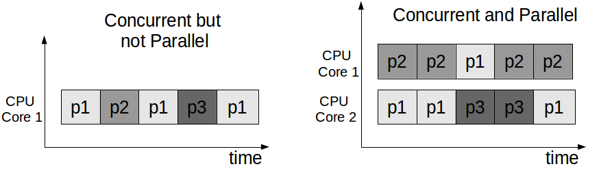
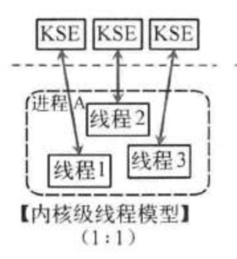
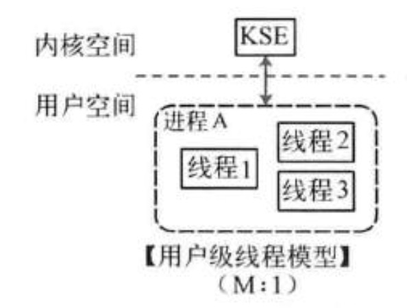
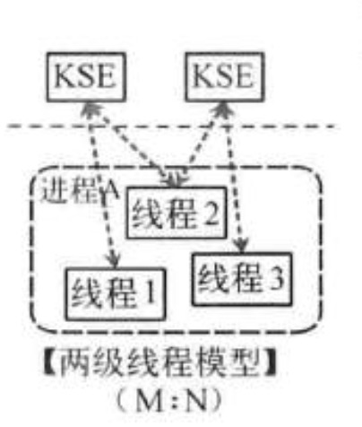
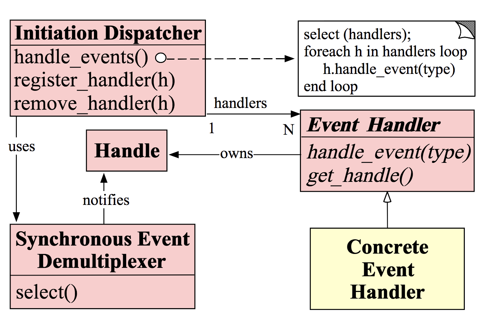
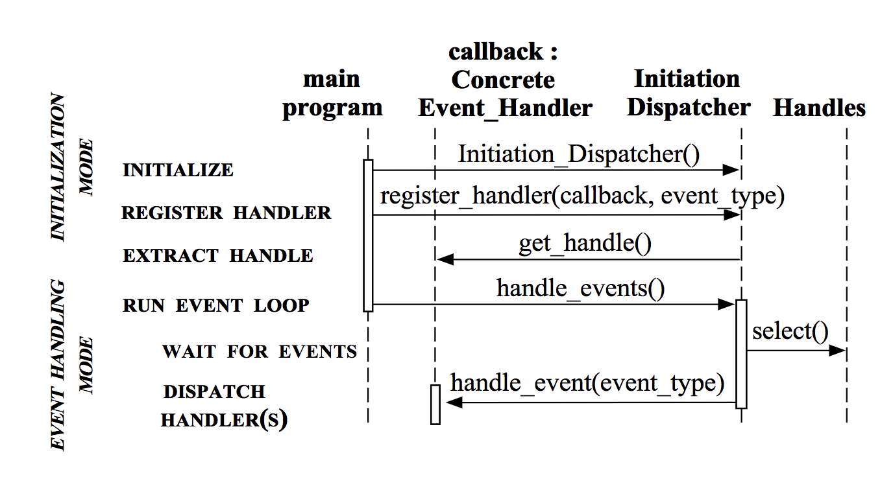
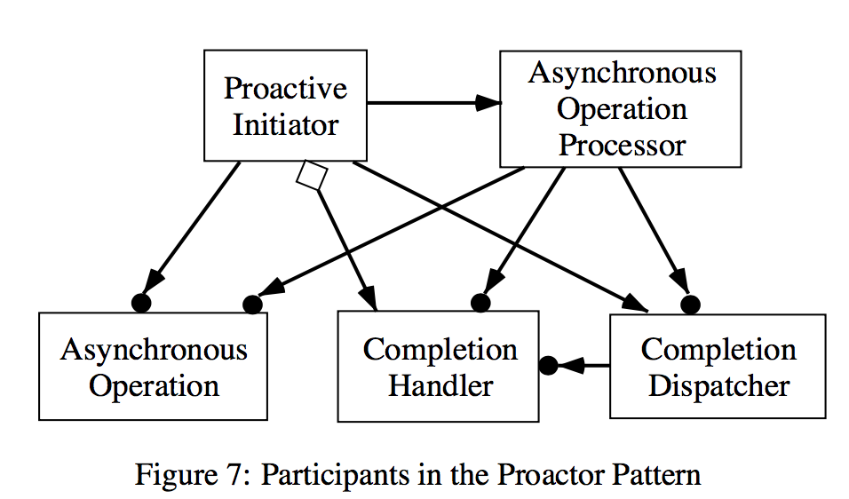
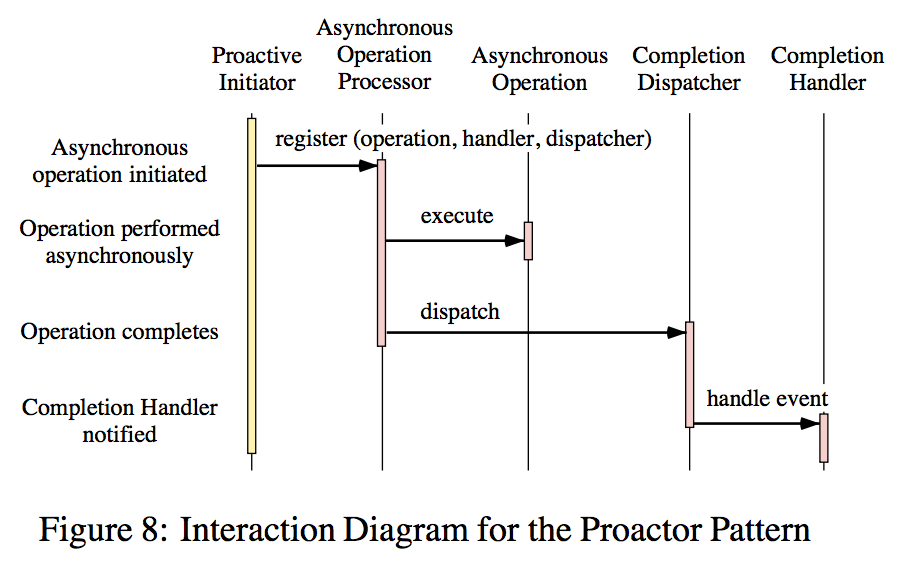
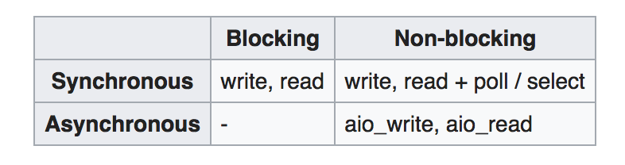

### Concepts

本节介绍并发相关的概念。有些概念的描述，在不同的场景下会有歧义和含糊不清。本文以Wiki的定义和描述为准。

 

**并发 VS 并行 （Concurrency vs. Parallelism）**

并发和并行是不同的概念。如图所示（图片来自[ref2](#2))：

* 并发是指相互独立的任务“一起工作”。在任一时间点，能同时工作的任务最多只有一个。
* 并行是指相互独立的任务“同时工作”。在任意时间点，能同时工作的任务可以有多个。

以gunicorn托管的服务器为例，当配置worker-class为gevent, workers为1，且服务器代码为异步IO时，多个request是并发的。workers大于1，其他条件和配置不变，多个request既是并发又是并行的。

[ref3](#3)提到，“而并行关注的是同时执行，必须是多（核）cpu，**要能并行的程序必须是支持并发的。**”这种说法容易引起歧义。[ref2](#2)提到，SIMD(Single Instruction, Multiple Data)架构是一种典型的并行而非并发的场景。Wiki原文如下：

> It describes computers with [multiple processing elements](https://en.wikipedia.org/wiki/Multiple_processing_elements) that perform the same operation on multiple data points simultaneously. Such machines exploit [data level parallelism](https://en.wikipedia.org/wiki/Data_parallelism), but not [concurrency](https://en.wikipedia.org/wiki/Concurrent_computing): there are simultaneous (parallel) computations, but only a single process (instruction) at a given moment. 

 

**进程，内核线程，用户线程，Fibers和协程 (Process, Kernel Threads, User Threads, Filbers and Coroutines)**

这几个概念是并发的基础。不严格的说，所有的单服务级别（非分布式）的并发，都离不开这几个概念。（**该论断有待验证，欢迎指正。**）几个概念中，进程和线程可能是最为大多数人所熟悉的。但内核线程和用户线程的不同，以及Fiber的概念，可能很多人会比较模糊。

WiKi([ref5](#5))上有一段关于这己个概念的精彩概述，建议精读。摘要引用如下：

> Scheduling can be done at the kernel level or user level, and multitasking can be done preemptively or cooperatively. 
>
> At the kernel level, a *process* contains one or more *kernel threads*, which share the process's resources, such as memory and file handles – a process is a unit of resources, while a thread is a unit of scheduling and execution. Kernel scheduling is typically uniformly done preemptively or, less commonly, cooperatively. At the user level a process such as a [runtime system](https://en.wikipedia.org/wiki/Runtime_system) can itself schedule multiple threads of execution. 
>
> while if they share data they are usually called *(user) threads*, particularly if preemptively scheduled. Cooperatively scheduled user threads are known as *fibers*; 
>
>  User threads may be executed by kernel threads in various ways (one-to-one, many-to-one, many-to-many). 
>
> A *process* is a "heavyweight" unit of kernel scheduling, as creating, destroying, and switching processes is relatively expensive. Processes own [resources](https://en.wikipedia.org/wiki/Resource_(computer_science)) allocated by the operating system. Resources include memory (for both code and data), [file handles](https://en.wikipedia.org/wiki/Handle_(computing)), sockets, device handles, windows, and a [process control block](https://en.wikipedia.org/wiki/Process_control_block). Processes are *isolated* by [process isolation](https://en.wikipedia.org/wiki/Process_isolation), and do not share address spaces or file resources except through explicit methods such as inheriting file handles or shared memory segments, or mapping the same file in a shared way – see [interprocess communication](https://en.wikipedia.org/wiki/Interprocess_communication). Creating or destroying a process is relatively expensive, as resources must be acquired or released. Processes are typically preemptively multitasked, and process switching is relatively expensive, beyond basic cost of [context switching](https://en.wikipedia.org/wiki/Context_switching), due to issues such as cache flushing.
>
> A *kernel thread* is a "lightweight" unit of kernel scheduling. At least one kernel thread exists within each process. If multiple kernel threads exist within a process, then they share the same memory and file resources. Kernel threads are preemptively multitasked if the operating system's process [scheduler](https://en.wikipedia.org/wiki/Scheduling_(computing)) is preemptive. Kernel threads do not own resources except for a [stack](https://en.wikipedia.org/wiki/Call_stack), a copy of the [registers](https://en.wikipedia.org/wiki/Processor_register) including the [program counter](https://en.wikipedia.org/wiki/Program_counter), and [thread-local storage](https://en.wikipedia.org/wiki/Thread-local_storage) (if any), and are thus relatively cheap to create and destroy. Thread switching is also relatively cheap: it requires a context switch (saving and restoring registers and stack pointer), but does not change virtual memory and is thus cache-friendly (leaving TLB valid). The kernel can assign one thread to each logical core in a system (because each processor splits itself up into multiple logical cores if it supports multithreading, or only supports one logical core per physical core if it does not), and can swap out threads that get blocked. However, kernel threads take much longer than user threads to be swapped.
>
> Threads are sometimes implemented in [userspace](https://en.wikipedia.org/wiki/User_space) libraries, thus called *user threads*. The kernel is unaware of them, so they are managed and scheduled in [userspace](https://en.wikipedia.org/wiki/User_space). Some implementations base their user threads on top of several kernel threads, to benefit from [multi-processor](https://en.wikipedia.org/wiki/Multiprocessing) machines ([M:N model](https://en.wikipedia.org/wiki/Thread_(computing))). 
>
> User threads as implemented by [virtual machines](https://en.wikipedia.org/wiki/Virtual_machine) are also called [green threads](https://en.wikipedia.org/wiki/Green_threads). User threads are generally fast to create and manage, but cannot take advantage of multithreading or multiprocessing, and will get blocked if all of their associated kernel threads get blocked even if there are some user threads that are ready to run.
>
> [Fibers](https://en.wikipedia.org/wiki/Fiber_(computer_science)) are an even lighter unit of scheduling which are [cooperatively scheduled](https://en.wikipedia.org/wiki/Cooperative_multitasking): a running fiber must explicitly "[yield](https://en.wikipedia.org/wiki/Yield_(multithreading))" to allow another fiber to run, which makes their implementation much easier than kernel or [user threads](https://en.wikipedia.org/w/index.php?title=User_threads&action=edit&redlink=1). A fiber can be scheduled to run in any thread in the same process. This permits applications to gain performance improvements by managing scheduling themselves, instead of relying on the kernel scheduler (which may not be tuned for the application). 
>
> Closely related to fibers are [coroutines](https://en.wikipedia.org/wiki/Coroutine), with the distinction being that coroutines are a language-level construct, while fibers are a system-level construct.

关键点：

* 在内核级别上，进程通常包含一个或多个(内核)线程，这些线程通过内核抢占式调度。
* 在用户级别上，一个进程，如runtime，可以调度多个(用户)线程。如果调度是抢占式的，这些线程称为用户线程，如果是合作式的，则称为fibers
* 抢占式和合作式调度，请参考[ref6](#6)
* 用户线程需要内核线程来执行，两者对应关系模型有一对一, 多对一和多对多
* 进程通常由内核抢占式调度。进程创建，销毁和切换的成本相对比较昂贵。
* 内核线程由内核抢占式调度(如果进程是抢占式调度的话)。内核线程创建，销毁和切换的成本相对较低。阻塞的内核线程会被换出。
* 用户线程通常在用户空间管理和调度，对内核空间透明。由virtual machine实现的用户线程也叫做green threads。用户线程创建和管理的成本很低，但是无法利用多线程/多进程的优势。(因为它们运行在同一内核线程，考虑多对一的场景)。当与之相关的内核线程阻塞之后，其他全部相关的用户线程都会被阻塞。
* 内核线程的切换成本远高于用户线程。
* Fibers是合作式调度的用户线程。一个运行的Fiber必须显式的让渡运行权，从而让其他fiber获得运行。
* Coroutine与Fiber非常相似，不同点在于Fiber是系统级别的，而coroutine是编程语言级别的。

 

**Threading Mapping Models**

运行在用户空间的线程需要对应的运行的内核空间的线程的支持。两者之间的对应关系，可以分为三种情况：

* 一对一 （kernel-level threading）

  用户空间创建的线程和内核空间的线程一一对应。这种实现最为简单和常见。Linux平台的GNU C Library采用的就是这个模型。严格来说，是NPTL(Native POSIX Thread Library)库采用了这个模型。NPTL是POSIX Thread的一个实现，用以替代LinuxThreads。NPTL从Linux2.6内核开始整合进入GNU C Library。

  后面我们将讨论到gevent和tornado的coroutine实现，两者都属于这种模型。运行事件循环的用户线程和内核线程一一对应，而coroutines则在同一用户线程内合作式调度。

* 多对一（user-level threading）

  用户线程和内核线程为多对一的对应关系。一个例子是GNU Portable Threads库。

  该模型下，用户线程在用户空间调度，内核线程对此无知，因此，线程上下文切换成本非常低。缺点是无法利用支持多线程/多进程的CPU。因为调度发生在用户空间，当某一用户线程发起阻塞式系统调用的时候，内核无法将对应该内核线程的其他处于等待状态的用户线程调度运行。这也是多对一模型通常要求异步IO的原因。

  在一对一模型，并且在用户线程内调度多coroutine的场景下，该问题同样存在。在web场景下（通常网络IO密集），解决办法通常是，通过多进程利用多核CPU，并且避免阻塞式IO调用。后面会继续讨论这个问题。

  前文提到，gevent和tornardo的coroutine实现属于一对一的对应模型。如果将两者实现的coroutine视为线程的话，也可将其理解为多对一模型的情况。网上很多文章执这样的说法。但是通过笔者试验，在同一线程的不同的Greenlet（gevent的coroutine实现）或Future（tornadao的coroutine实现）运行期间，获取当前线程ID，得到的线程ID相同的。因此，笔者倾向于将其归于一对一模型。

* 多对多（hybrid threading）

  用户线程和内核线程M:N的对应的关系。这种实现最为复杂。但是用户线程一块阻塞的问题将不复存在。

  当某个用户线程发起阻塞式系统调用，该用户线程和对于的内核线程会被调度出去，同时，其他就绪的用户线程会被调度到其它可用的内核线程继续运行。

  Go语言号称采用了这种模型。后面会继续讨论。

对应关系模型示意图: 来自[ref11](#11)

<dev align="center">

</dev>
 

**I/O Models**

提到并发，就不得不提《UNIX网络编程卷1》中提到的I/O模型。所有的并发实现方案，到了底层，都绕不开I/O模型。

《UNIX网络编程卷1》提到五种I/O模型：

* 阻塞式I/O (blocking I/O)
* 非阻塞式I/O (nonblocking I/O)
* I/O复用 (I/O multiplexing)
* 信号驱动式I/O (signal-driven I/O)
* 异步I/O (aynchronous I/O)

五种模型的详细定义请自行阅读神书，不再赘述。这里仅谈一些其它问题。

神书中作者提到了两个术语：同步I/O和异步I/O，并提到了POSIX对此的定义：

> 同步I/O操作（synchronous I/O operation）导致请求进程阻塞，直到I/O操作完成。
>
> 异步I/O操作（asynchronous I/O operation）不导致请求进程阻塞。

并且根据这个定义，前四个模型都属于同步I/O操作。因为其中的I/O操作（recvfrom）将阻塞请求进程。只有异步I/O模型，符合POSIX关于异步I/O操作的定义。

但问题是，目前Linux平台缺少成熟的AIO实现，无论是POSIX asynchronous I/O（通过 GLibc在用户空间利用多线程模拟实现，存在设计和实现方面的一些问题。[ref14](#14)给出了一堆槽点），还是kernel AIO（目前的实现有诸多限制[ref15](#15)），还是第三方库（libeio,目前处于Beta版本[ref16](#16)），都存在问题或者不够成熟。

正是因为这个问题，目前的Linux平台的并发方案以I/O复用模型为主。那么问题来了，

* 我们知道，根据POSIX的定义，I/O复用模型是同步的。因为进程在执行实际的I/O操作的时候，比如recvfrom, 是阻塞的。也就是说，用户进程会陷入内核进程，直到内核进程将数据从内核进程复制到用户进程并返回。在这段时间内，用户进程是阻塞的，做不了任何事情。此时，根据前面的讨论，在多对一的场景下（或一对一场景，并且用户线程合作式调度多个coroutine），用户空间的其他线程，全部被阻塞。可想而知，这会浪费很多CPU时间。
* I/O复用的支持函数是阻塞的。结合之前的讨论，相同的场景下（多对一，或一对一，并且用户线程合作式调度多个coroutine），当时间循环调用select并陷入内核线程之后，在返回或者过时之前，整个用户线程是阻塞的。以gunicorn(基于gevent)为例，此时gunicorn的这个worker是阻塞的，是无法接受新的request的。Tornado的HttpServer同样如此。

从文档来看，似乎Go语言可以避免这个问题。后面继续讨论。

 

**Reactor VS Proactor**

Reactor和Proactor是并发请求场景下关于事件处理的两种设计模型。Wiki([ref17](#17),[ref18](#18))对两个模型的定义，并未强调“并发”，但是提出这两个概念的论文([ref19](#19),[ref20](#20))，都是在并发问题的场景下，引入了这两个概念。

* Reactor

  [Ref19](#19)描述了Reactor模型中的角色和工作方式。Reactor模型有以下几种角色：

  * Handles。也就是[Ref17](#17)提到的Resources。如network  connections,  open files,  timers,  synchronization objects,  等等。

  * Event Handler (Concrete Event Handler)。事件的实际处理程序。

  * Synchronous Event Demultiplexer。作用是阻塞式等待资源集上事件的发生。当时间发生时，返回。对于I/O来说，一个常见的例子是select系统调用。

  * Initiation Dispatcher。 提供一组接口，支持Event Handler的注册，注销和分发。当关注的事件发生的时候，Demultiplexer会通知Dispatcher，而后者会调用Event Handler的处理过程。

  OMT 类图和交互图如下（来自[Ref19](#19)）
  
  

  
  
  

  Reactor模型的使用非常广泛。后面将要讨论的gevent和tornado的并发机制，都是基于Reactor
  模型。 [Ref21](#21)提到，Redis的文件事件处理器也是基于Reactor模型。研究Redis的时候，再补充相关细节。

* Proactor

  Reactor模型虽然应用非常广泛，但还是有很多问题。Proactor模型的出现，就是为了解决这些问题。[Ref20](#20)列举了这些问题：

  * Reactor模型带来了编程复杂性的提高。这一点主要是指开发者需要避免阻塞式系统调用。
  * 缺少对多线程的支持。多数的操作系通过selelct等系统调用分离事件，而**select不允许多个线程对同一资源集上循环等待**。这一点笔者做过试验，在Linux和Mac平台下是可以的。（论文中的这个论断，有可能跟早期操作系统的实现有关？）
  * 运行任务的调度。在同步的多线程抢占式调度的实现方法中，线程的调度是由操作系统完成的。这种操作系统级别的调度不适用基于Reactor的实现体系，因为它只允许一个（内核）线程。所以，开发者需要自行调度多个运行任务。这段论述实际上描述的一对一线程模型和多对一线程模型的问题。

  Proactor模型具有以下角色：

  * Proactive Initiator。可以理解为异步I/O的发起方。比如，web服务器中接受读写socket的代码组件。Proactive Initiator发起异步操作的时候，需要向Asynchronous Operation Processor注册一个Completion Handler和一个 Completion Dispatcher。
  * Asynchronous Operation。异步操作。由Proactive Initiator发起。
  * Asynchronous Operation Processor。异步操作执行者。一般由操作系统实现。异步操作完成之后，会通知到Completion Dispatcher。
  * Completion Dispatcher。 异步IO完成之后，负责调用对应的Completion Handler。
  * Completion Handler。异步IO操作完成之后的处理程序。

  OMT 类图和交互图如下（来自[Ref20](#20)）
  

  
  
  

* Reactor VS Proactior

  两个模型最大的不同在于， I/O操作由谁来完成。

  * Reactor模型中，采用select等系统调用做Dispatcher。得到Demultiplexer的通知之后（实际上是IO可操作的事件）之后，Dispatcher会调用Event Handler处理程序。因此，实际的IO操作是由Event Handler来完成。而根据神书《unix网络编程卷I》的定义，这种场景属于非阻塞同步IO模型。
  * Proactor模型中，异步IO操作由操作系统完成，Dispatcher会调用Event Handler处理程序的时候，IO操作已经完成（这个过程包括等待IO可操作和实际的IO操作两部分）。这种场景在神书中被定义为“真正意义上的”异步IO模型。
  * 参照[ref22](#22)的经典图示：
    
    Reactor模型对应的场景为Synchronous+Non-blocking, Proactor模型对应的场景为Asynchronous+Non-blocking
  * AIO库不成熟不成熟，导致了目前Proactor模型较少见。Nginx有部分采用kernel AIO，不确定是否有采用Proactor模型。

 

**Multi-Processing & Threading**

**Event-Loop + Callabck**

**Green Thread**

**Protothread**

**Fiber vs. Corouting**

**Goroutine**

**CSP vs. Actor**

#### Reference

1. [Rob Pike’s talk][rp]
2. [Overview of Modern Concurrency and Parallelism Concepts][omcpc]
3. [并发之痛 Thread，Goroutine，Actor][bfzt]
4. [SIMD][simd]
5. [Thread][thread]
6. [Preemtive Multitasking][pm]
7. [GNU C Library][glibc]
8. [POSIX Threads][pthreads]
9. [NPTL][nptl]
10. [GNU Portable Threads][pth]
11. [Go并发原理][gcp]
12. UNIX网络编程卷1
13. [linux下的异步IO（AIO）是否已成熟][aiosfcs]
14. [Asynchronous I/O and event notification on linux][aioaen]
15. [Kernel Asynchronous I/O (AIO) Support for Linux][aiok]
16. [libeio][ibeio]
17. [Reactor][reactor]
18. [Proactor][proactor]
19. Schmidt, Douglas C., An Object Behavioral Pattern for Demultiplexing and Dispatching Handles for Synchronous Events
20. Proactor - An Object Behavioral Pattern for Demultiplexing and Dispatching Handlers for Asynchronous Events
21. [Redis与Reactor模式][redis]
22. [Asynchronous I/O][aiow]

[rp]: https://vimeo.com/49718712
[omcpc]:https://nikolaygrozev.wordpress.com/2015/07/14/overview-of-modern-concurrency-and-parallelism-concepts/
[bfzt]: http://jolestar.com/parallel-programming-model-thread-goroutine-actor/
[simd]: https://en.wikipedia.org/wiki/SIMD
[thread]: https://en.wikipedia.org/wiki/Thread_(computing)
[pm]: https://en.wikipedia.org/wiki/Preemption_(computing)#Preemptive_multitasking
[glibc]: https://en.wikipedia.org/wiki/GNU_C_Library
[pthreads]: https://en.wikipedia.org/wiki/POSIX_Threads
[nptl]: https://en.wikipedia.org/wiki/Native_POSIX_Thread_Library
[pth]: https://en.wikipedia.org/wiki/GNU_Portable_Threads
[gcp]: https://i6448038.github.io/2017/12/04/golang-concurrency-principle/
[aiosfcs]: https://www.zhihu.com/question/26943558
[aioaen]: http://davmac.org/davpage/linux/async-io.html#posixaio
[aiok]: http://lse.sourceforge.net/io/aio.html
[libeio]: http://software.schmorp.de/pkg/libeio.html
[reactor]: https://en.wikipedia.org/wiki/Reactor_pattern
[proactor]: https://en.wikipedia.org/wiki/Proactor_pattern

[redis]: http://www.dengshenyu.com/%E5%90%8E%E7%AB%AF%E6%8A%80%E6%9C%AF/2016/01/09/redis-reactor-pattern.html

[ aiow ]: https://en.wikipedia.org/wiki/Asynchronous_I/O

