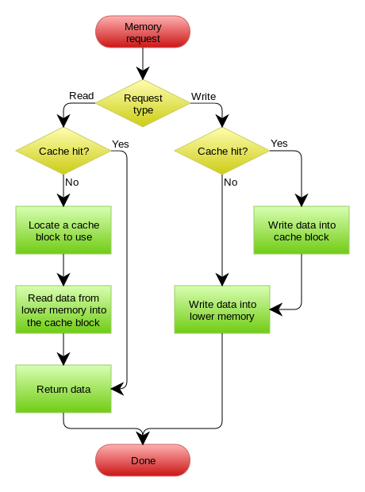

#### 缓存更新模式

四种缓存更新模式

* Cache Aside Pattern
* Read/Write Through Pattern
* Write Behind Caching Pattern

**Cache Aside Pattern**

最常用的模式。逻辑如下：

* 失效：先取缓存，未命中，从数据库取数据，放到缓存，返回。

* 命中：从缓存取数据，返回。

* 更新：先写数据到数据库，再让缓存失效。

下图来自[缓存更新的套路][hcgxd]

关键问题：

* 为什么强调先写数据库，再失效缓存？

  如果先失效缓存，再写数据库，容易导致脏数据。

  场景如下：

  并发读写情况下，写操作失效缓存，随后读操作读取旧数据，并set缓存。在缓存数据过期之前，无法感知和纠正。

* 为什么强调让缓存数据失效，而不是更新到新的值？

  更新缓存数据，并发写场景下，容易导致由竞争条件引发的数据覆盖，从而导致数据不一致。

* 缓存中的数据是否一定没有问题？

  1. 该方案在极端情况下，依然存在竞争条件导致数据不一致的问题。考虑如下场景：
     1.	某时刻，缓存数据失效。读操作请求数据库获得“旧”数据。
     2.	写操作更新数据库，失效缓存(缓存事实上已经失效)。
     3.	读操作讲“旧”数据更新到缓存

  2. 缓存失效操作失败。

     写数据库成功之后，缓存失效操作失败，导致数据不一致。

* 问题1，本质上是竞争条件。解决思路为加锁。todo

  1. 允许最终一致的情况下，可以忽略。设置合适的缓存失效时间。这种情况出现的可能性非常低。
  2. 将更新数据库和缓存失效的操作放在数据库事务内实现。锁记录，缓存失效，提交。
  3. 采取类似2PC或者Paxos之类的协议，保证一致性。

* 问题2， 本质上是分布性一致性问题。

  1. 允许最终一致的情况下，忽略。设置合适的缓存失效时间。

  2. 同步重试缓存失效操作。

  3. 异步缓存失效。(canal+mq, etc. todo)

  4. 将更新数据库和缓存失效的操作放在数据库事务内。

  5. 采取类似2PC或者Paxos等分布式一致性协议。

  方案4，5会对性能造成影响，需要仔细评估采取这两种方案的必要性。

* FB的方案。 FB对memcache的扩展，采取的就是Cache Aside Pattern. trand-off的核心点是，

  * 要么采用分布式一致性协议，保证强一致性，牺牲可用性。
  * 要么强调可用性，牺牲一定的一致性，尽量降低不一致的可能性。

**Read/Write Through Pattern**

更新数据库的操作由缓存服务代理。从调用方服务的角度来看，类似于数据存储服务维护自己的缓存。

Read Through 套路就是在查询操作中更新缓存，也就是说，当缓存失效的时候（过期或LRU换出），Cache Aside是由调用方负责把数据加载入缓存，而Read Through则用缓存服务自己来加载，从而对应用方是透明的。

Write Through 套路和Read Through相仿，不过是在更新数据时发生。当有数据更新的时候，如果没有命中缓存，直接更新数据库，然后返回。如果命中了缓存，则更新缓存，然后再由Cache自己更新数据库（这是一个同步操作）

下图来自维基cache词条

关键问题：

* 在分布式的场景下，Read/Write Through 在实现上，会演变成Cache Aside. 
  * “分布式的场景下”，是指在缓存服务内部，执行具体缓存操作的组件和数据库组件，是分布式的。
  * 此时，缓存服务在执行“更新数据库”和“缓存组件”内的缓存数据时，与调用方面临完全相同的问题。
  * 因此，这种场景下，Read/Write Through在内部实现时，面临与Cache Aside完全相同的问题集。
* 由上图的逻辑**推测**，严格意义上的Read/Write Through Pattern的使用场景是应该单机模式下的。这种场景下，数据在两份存储介质中同步失败的几率非常非常低。[TBD]

**Write Behind Caching Pattern**

也叫做Write Back. 类似于Linux 文件系统Page Cache算法。更新数据的时候，只更新缓存，不更新数据库。缓存系统异步的更新数据库。

下图来自维基cache词条

关键问题：

* 优势：
  * 缓存服务返回速度快。只更新内存，不更新数据库。
  * 缓存更新数据库速度相对快。批量更新。
* 劣势
  * 数据可能丢失，造成不一致
  * 实现逻辑复杂

[hcgxd]: https://coolshell.cn/articles/17416.html