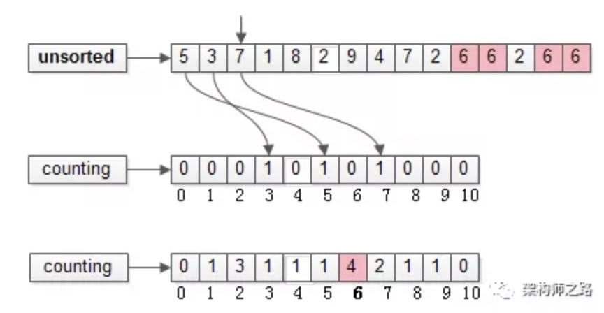
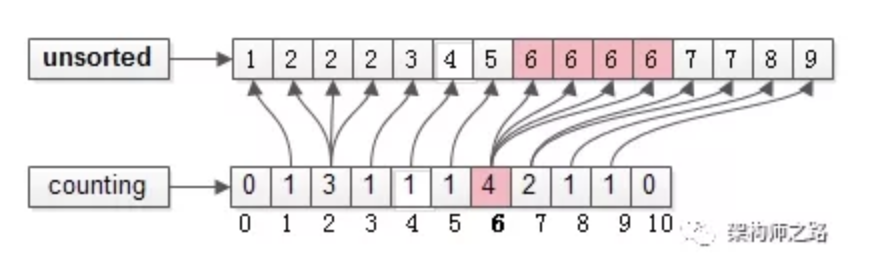

#### counting sort

**致谢FIRST**

本文重度参考[拜托，面试别再问我计数排序了！！！][btmsb]，**向作者致谢**！

**原理**

* 分布排序，非比较排序
* 用额外存储空间$$C(k)$$统计每个元素出现的次数，$$k=max-min+1$$, 其中，$$max, min$$ 为待排序元素的最大值和最小值
* 根据每个元素出现的次数，确定其在排序后数组中的位置。

**步骤**

```
step1. 遍历input_array，统计每个元素出现的次数，放入counting_array
step2. 累加counting_array，确定每个元素在out_array(排序后数组)中的位置(最后位置)
step3. 遍历input_array, 将每个元素放入out_array对应的位置
```

(以下图片来自来自微信文章[拜托，面试别再问我计数排序了！！！][btmsb]。请注意，以下图片所示的counting sort过程，**丢了排序的稳定性，并非“严格意义”上的计数排序**。但是可以直观的展示计数排序的原理)

待排序数组$$arr={5, 3, 7, 1, 8, 2, 9, 4, 7, 2, 6, 6, 2, 6, 6}$$

1. 统计每个元素出现的个数

    

2. 根据每个元素出现的次数，确定元素在输出数组的位置，并将其放入输出数组

   

   排序完成


**实现**

```python
def get_max_and_min(l):
    max_num = min_num = l[0]
    for x in l:
        if max_num < x:
            max_num = x
        elif min_num > x:
            min_num = x
    return max_num, min_num
  
  
def counting_sort_stable_strict(l):
	"""
	稳定排序
	严格控制counting_arr 和 output_arr的size
	"""
    max_num, min_num = get_max_and_min(l)
    k = max_num - min_num + 1
    c = [0] * k  # restrict side of counting_arr
    s = [0] * len(l)

    for x in l:
        c[x - min_num] += 1
        
    for index in range(k-1):
        c[index+1] += c[index]

    for index in range(len(l), 0, -1):  # important, how the sort is stable
        input_val = l[index-1]
        offset = input_val - min_num
        s[c[offset]-1] = input_val
        c[offset] -= 1

    return s


def counting_sort_unstable_2(l):
    """
    该函数展示上图所描述的过程，可以看到，这种实现虽然简单易懂，但是会丧失排序的稳定性
    """

    max_num, min_num = get_max_and_min(l)
    k = max_num - min_num + 1
    c = [0] * k

    for x in l:
        c[x - min_num] += 1

    pointer = 0
    for index in range(len(c)):
        for _ in range(c[index]):
            value = index + min_num
            l[pointer] = value
            pointer += 1
```


**稳定性**

根据实现方式的不同，稳定性可能不同

**效率**

**适用场景**

**Reference**

* [计数排序][jspx]
* [counting sort][cs]
* [拜托，面试别再问我计数排序了！！！][btmsb]


[jspx]: https://zh.wikipedia.org/wiki/%E8%AE%A1%E6%95%B0%E6%8E%92%E5%BA%8F
[cs]: https://en.wikipedia.org/wiki/Counting_sort
[btmsb]: https://mp.weixin.qq.com/s?__biz=MjM5ODYxMDA5OQ==&mid=2651961665&idx=1&sn=b7a6d0ca45a0b91801778baec0f759c6&chksm=bd2d0c9d8a5a858b0fc54dbc08d75ecdb4f11383a97222aede422c9f72a7c0240d82e5833aec&scene=21#wechat_redirect