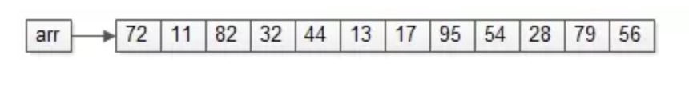
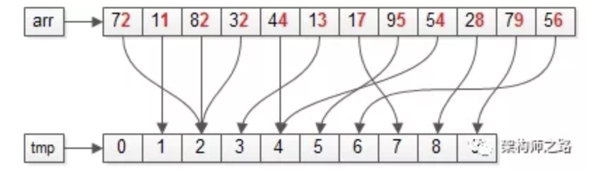
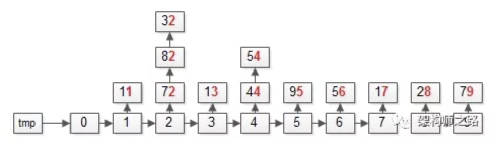
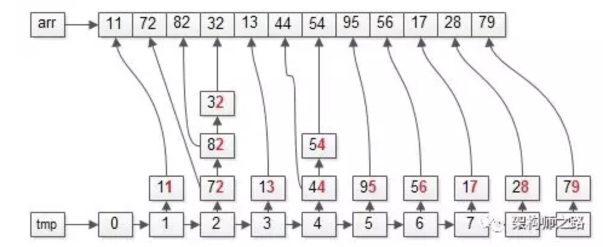
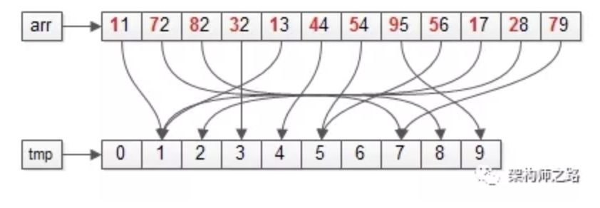
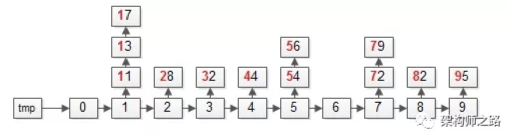
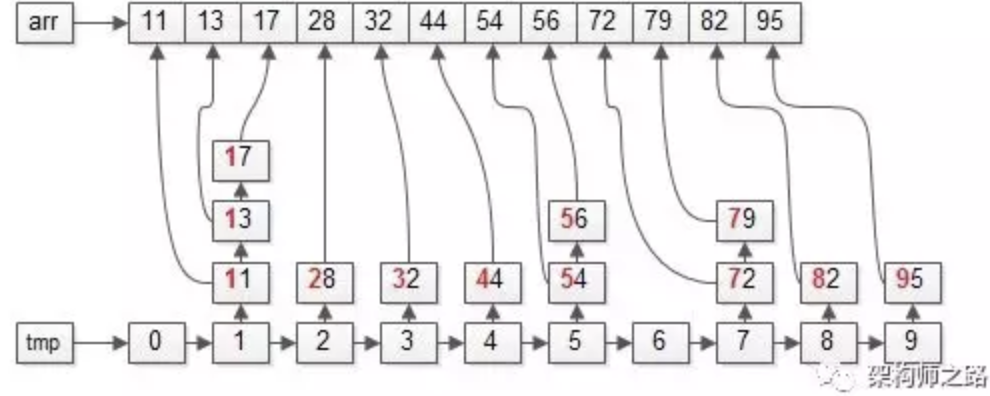

#### Radix Sort

**致谢FIRST**

本文重度参考[拜托，面试别再问我基数排序了][btmsb]，**向作者致谢**！

**原理**

* 非比较排序。将数字按进制分隔，根据分隔后的每一位进行排序。
* radix(基)：将数字按进制分隔。如，1024，
  * 按10进制分隔，radix=10, 每个基位上的值为1，0，2，4
  * 按16进制分隔，radix=16, 每个基位上的值为4，0，0
* k(循环轮数)。数字分隔之后的位数。如，1024
  * 按10进制分隔，循环轮数为4。 (1, 0, 2, 4共4位)
  * 按16进制分隔，循环轮数为3。（4, 0, 0 共3位）
* buckets(桶): 分隔后，每个基位上值的范围。如，1024
  * 按10进制分隔，每个基位上的取值范围为0-9，需要10个桶
  * 按16进制分隔，每个基位上的取值范围为0-F，需要16个桶

**步骤**

```
FOR k轮循环 {
    step1. 遍历排序数组，分隔每个元素，根据分隔后对应位数的数字，将元素放入对应的桶
    stpe2. 遍历桶，将元素放回原数组
}

```

以下图片来自微信文章[拜托，面试别再问我基数排序了][btmsb]

1. 待排序数组

   按10进制分隔，可知循环轮数为2(每个数字分隔后，均为2位)，需要10个桶

   

2. 第一轮循环第一步，按照分隔后的“个位”，将元素放入对应的桶

   

   操作完之后，桶内数据如图

   

3. 第一轮循环第二步，将桶内数据放回原数组。(注意，**FIFO可以保证排序是稳定的**)

   

   操作完成之后，数组整体按照“个位”排序

4. 第二轮循环第一步，按照分隔后的“十位”，将元素放入对应的桶

   

   操作完之后，桶内数据如图

   

5. 第一轮循环第二步，将桶内数据放回原数组。

   

   操作完成之后，数组整体按照“十位”排序。排序完成。


**实现**

radix = 16 的 python 实现

```python
"""
describe the details of the approach, 
so, try not to use the lib or built-in functions
"""


def find_max(l):
    mx = 0
    for x in l:
        if mx < x:
            mx = x
    return mx


def get_loop_number(num):
    """
    how many loops need.
    """
    c = 0
    while num:
        c += 1
        num >>= 4
    if not c:
        return 1
    return c


def radix_sort(l):
    max_number = find_max(l)
    loop_number = get_loop_number(max_number)

    for x in range(loop_number):
        buckets = [[] for _ in range(16)]  # need 16 buckets.
        for num in l:
            buckets[(num >> 4 * x) & 15].append(num)
        del l[:]  # reuse original list
        for bucket in buckets:
            l.extend(bucket)
```

**效率**

* 时间复杂度是$$O(kn)$$, $$k$$是循环的轮数，$$k$$是排序元素的个数。
* $$k = \log_B(N)$$, $$B$$是基, $$N$$可以简单理解为待排序元素的最大值。 
* 每一轮循环，分隔每个待排序元素的操作为常数$$O(1)$$，整轮循环是$$O(n)$$。
* 因此，排序的平均时间$$T \approx log_B(N) \times n$$
* $$\log_B(N)$$与$$n$$无关
* 当$$N$$非常大，$$B$$相对较小，比如$$2$$, 会导致$$\log_B(N) > \log(n)$$，从而导致基数排序的性能低于快速排序等算法。

**Reference:**

* [基数排序][jspx]
* [拜托，面试别再问我基数排序了][btmsb]
* [Radix sort][radix_sort]


[jspx]: https://zh.wikipedia.org/wiki/%E5%9F%BA%E6%95%B0%E6%8E%92%E5%BA%8F
[btmsb]: https://mp.weixin.qq.com/s?__biz=MjM5ODYxMDA5OQ==&mid=2651961634&idx=1&sn=1e9617d6f6bd2790eabedca22ea49879&chksm=bd2d0cfe8a5a85e8dd52dd0453abe7118932f3dd0068682c6829c37d69e197acfe0efff051e7&scene=21#wechat_redirect
[radix_sort]: https://en.wikipedia.org/wiki/Radix_sort

